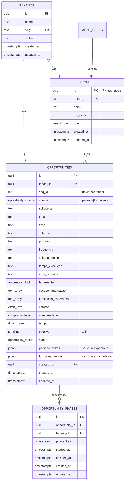

# DATA-MODEL — CoE Hiperautomação

> Modelagem de dados do MVP. Fonte da verdade: este documento + a migration em [supabase/migrations/0001_init.sql](../supabase/migrations/0001_init.sql).
> Toda evolução de schema vira nova migration numerada; este doc é atualizado em sincronia.

## Princípios

1. **Um único projeto Supabase compartilhado por todos os tenants.** Isolamento = Row Level Security (RLS).
2. **`tenant_id uuid not null`** em toda tabela de domínio. Sem exceção.
3. **RLS sempre ligado.** Policies usam `current_tenant_id()` (helper SECURITY DEFINER que lê o `tenant_id` do `profiles` do `auth.uid()` corrente).
4. **Score nunca persistido.** Função SQL `opportunity_score()` recalcula sob demanda. View `opportunities_with_score` expõe pronto pro front.
5. **Identificadores em inglês**, valores de enum em português snake_case (refletem o domínio do cliente).
6. **`updated_at` mantido por trigger** em todas as tabelas.

## Diagrama ER



## Enums

| Enum | Valores | Origem |
|------|---------|--------|
| `opportunity_source` | `persona`, `formulario` | Mockup: campo `tipo` |
| `opportunity_status` | `novo`, `em_analise`, `planejamento`, `backlog`, `desenvolvimento`, `homologacao`, `producao`, `concluido` | Mockup: `STATUS_ORDER` (linha 398) |
| `automation_tool` | `rpa`, `n8n`, `ambos` | Mockup: `ferramenta` |
| `effort_level` | `baixo`, `medio`, `alto` | Mockup: `prioridade.esforco` |
| `complexity_level` | `baixo`, `medio`, `alto` | Mockup: `prioridade.complexidade` |
| `time_bucket` | `pequeno`, `medio`, `grande` | Mockup: `prioridade.tempo` |
| `phase_key` | `em_analise`, `planejamento`, `backlog`, `desenvolvimento`, `homologacao`, `producao`, `concluido` | Mockup: `PHASES_DEF` (linha 399) — note: status `novo` não tem fase porque é o estado pré-pipeline |
| `tenant_role` | `member`, `tenant_admin` | Hoje só `member` é usado. `tenant_admin` reservado para admin de tenant (próprio cliente gerenciar seus usuários) |

## Tabelas

### `tenants`

Empresa contratante do CoE. Cada cliente que assina a SaaS = 1 linha aqui.

| Coluna | Tipo | Notas |
|--------|------|-------|
| `id` | `uuid PK` | `default gen_random_uuid()` |
| `name` | `text not null` | Razão social ou nome de exibição |
| `slug` | `text not null unique` | Identificador URL-friendly (`fgcoop`, `acme`). Imutável após criação |
| `status` | `text not null default 'active'` | `active` \| `suspended` |
| `created_at`, `updated_at` | `timestamptz` | |

**RLS:** apenas leitura — usuário vê só o tenant ao qual pertence. INSERT/UPDATE/DELETE fora do escopo do MVP (operação manual via Supabase Studio).

### `profiles`

Estende `auth.users` (gerenciada pelo Supabase Auth). Cada usuário pertence a **exatamente um tenant**.

| Coluna | Tipo | Notas |
|--------|------|-------|
| `id` | `uuid PK` | FK `auth.users(id) on delete cascade` |
| `tenant_id` | `uuid not null` | FK `tenants(id) on delete restrict` |
| `email` | `text not null` | Espelho de `auth.users.email` para queries sem JOIN |
| `full_name` | `text` | |
| `role` | `tenant_role not null default 'member'` | |
| `created_at`, `updated_at` | `timestamptz` | |

**Trigger `handle_new_user()`:** quando uma linha entra em `auth.users`, cria automaticamente um `profile`. O `tenant_id` vem do `raw_user_meta_data->>'tenant_id'` (preenchido no signup) ou da `app_metadata` (preenchido por admin via Supabase Studio na criação manual de novos clientes).

**RLS:** usuário lê apenas profiles do próprio tenant. Update só do próprio registro.

### `opportunities`

Entidade central. **Persona** e **formulário** moram na mesma tabela (discriminator `source`), com campos exclusivos em JSONB.

| Coluna | Tipo | Notas |
|--------|------|-------|
| `id` | `uuid PK` | |
| `tenant_id` | `uuid not null` | FK `tenants on delete cascade` |
| `seq_id` | `int not null` | Sequencial **por tenant** (1, 2, 3…). Preenchido por trigger `set_opportunity_seq_id()`. Unique `(tenant_id, seq_id)` |
| `source` | `opportunity_source not null` | |
| `solicitante` | `text not null` | Nome da pessoa que pediu |
| `email` | `text` | Pode estar vazio (vide mockup) |
| `area` | `text not null` | Texto livre por enquanto (autocomplete via DISTINCT no front) |
| `subarea` | `text` | |
| `processo` | `text not null` | Nome do processo / oportunidade |
| `frequencia` | `text` | Texto livre (mockup tem "Diária", "Mensal", "–") |
| `volume_medio` | `text` | |
| `tempo_execucao` | `text` | |
| `num_pessoas` | `text` | Texto livre porque mockup usa formatos variados ("Gerência (1)", "5–10") |
| `ferramenta` | `automation_tool` | Pode ser null no início (decisão posterior) |
| `escopo_automacao` | `text[] not null default '{}'` | Lista de itens do escopo |
| `beneficios_esperados` | `text[] not null default '{}'` | |
| `esforco` | `effort_level` | Componente do score |
| `complexidade` | `complexity_level` | |
| `tempo` | `time_bucket` | |
| `objetivo` | `smallint check (objetivo between 1 and 5)` | |
| `status` | `opportunity_status not null default 'novo'` | |
| `responsavel` | `text` | Pessoa do CoE responsável pela oportunidade. Texto livre no MVP; vira FK `profiles` quando admin existir |
| `notas` | `text` | Notas internas livres (não visível ao solicitante, apenas ao CoE) |
| `persona_extras` | `jsonb` | Preenchido se `source='persona'`. Schema documentado abaixo |
| `formulario_extras` | `jsonb` | Preenchido se `source='formulario'`. Schema documentado abaixo |

**Schema de `persona_extras` (JSONB):**

```json
{
  "cargo": "Gerente Jurídica",
  "tempo_funcao": "8 anos",
  "local": "Brasília/DF",
  "papel": "• Assessoria jurídica estratégica ...",
  "sistemas": "Protheus, Teams, ...",
  "objetivos": "Incorporar inovação ...",
  "metricas": "Nenhuma formal ...",
  "desafios": "• Falta de ferramentas ...",
  "dados": "Internet e IA ...",
  "automacao_atual": "Nenhuma ...",
  "expectativas": "Obter dados confiáveis ...",
  "priorizacao_desc": "Geração de minutas é prioridade ...",
  "observacoes": "",
  "processos_detalhados": ["Processo 1", "Processo 2"]
}
```

**Schema de `formulario_extras` (JSONB):**

```json
{
  "tipo_processo": "Backoffice / Operacional",
  "sistemas": "ERP Protheus, Excel",
  "criterios": {
    "regras_claras": "SIM",
    "totalmente_manual": "SIM",
    "processo_uniforme": "SIM",
    "digitacao_manual": "SIM",
    "causa_reclamacoes": "PARCIAL",
    "padronizacao_docs": "SIM",
    "validacao_dados": "SIM",
    "schedulable": "SIM",
    "tem_documentacao": "NAO",
    "decisao_humana": "NAO"
  },
  "beneficios": {
    "reducao_tempo": 5,
    "eliminacao_erros": 4,
    "produtividade": 5,
    "qualidade_dados": 4,
    "reducao_custos": 3,
    "reducao_retrabalho": 4,
    "compliance": 3,
    "objetivos_estrategicos": 4
  }
}
```

Cada critério aceita `"SIM"` | `"NAO"` | `"PARCIAL"`. Cada benefício é int de 1 a 5 (escala "1=nada alinhado → 5=totalmente alinhado", vide mockup linha 717).
| `created_by` | `uuid` | FK `profiles(id) on delete set null` |
| `created_at`, `updated_at` | `timestamptz` | |

**Constraint check:** garantir consistência do discriminator:
```sql
check (
  (source = 'persona' and formulario_extras is null) or
  (source = 'formulario' and persona_extras is null) or
  (persona_extras is null and formulario_extras is null)
)
```

**Índices:**
- `(tenant_id, status)`
- `(tenant_id, source)`
- `(tenant_id, area)`
- `(tenant_id, created_at desc)`
- GIN em `escopo_automacao`, `beneficios_esperados`, `persona_extras`, `formulario_extras` (futuro — quando habilitarmos busca)

**RLS:** CRUD completo restrito ao próprio tenant.

### `opportunity_phases`

Timeline de cada fase do pipeline. Uma linha por (opportunity, phase) — pré-criadas todas as 7 fases quando a oportunidade entra em `em_analise` pela primeira vez (não precisamos disso de cara; pode ser sob demanda na primeira transição). Para o MVP, **gravar 1 linha por fase apenas quando começar** (started_at = now()) e completar com finished_at quando sair.

| Coluna | Tipo | Notas |
|--------|------|-------|
| `id` | `uuid PK` | |
| `opportunity_id` | `uuid not null` | FK `opportunities on delete cascade` |
| `tenant_id` | `uuid not null` | FK `tenants` — denormalizado para simplificar RLS |
| `phase_key` | `phase_key not null` | |
| `started_at` | `timestamptz` | |
| `finished_at` | `timestamptz` | |
| `created_at`, `updated_at` | `timestamptz` | |

`unique (opportunity_id, phase_key)`.

**RLS:** mesmo padrão por tenant_id.

## Funções

### `current_tenant_id()` — helper de RLS

```sql
create or replace function current_tenant_id()
returns uuid
language sql
stable
security definer
set search_path = public
as $$
  select tenant_id from profiles where id = auth.uid()
$$;
```

`security definer` permite que a policy leia `profiles` sem disparar RLS recursivo. `stable` permite cache no escopo da query.

### `opportunity_score()` — reproduz a fórmula do mockup ([linhas 410-413](../fgcoop-coe-v2.html#L410-L413))

```sql
create or replace function opportunity_score(
  p_esforco effort_level,
  p_complexidade complexity_level,
  p_tempo time_bucket,
  p_objetivo smallint
) returns int
language sql
immutable
as $$
  select round(
    case p_esforco when 'baixo' then 25 when 'medio' then 15 when 'alto' then 5 else 0 end
    + case p_complexidade when 'baixo' then 25 when 'medio' then 15 when 'alto' then 5 else 0 end
    + case p_tempo when 'pequeno' then 25 when 'medio' then 15 when 'grande' then 5 else 0 end
    + (least(5, coalesce(p_objetivo, 1))::numeric / 5 * 25)
  )::int;
$$;
```

### View `opportunities_with_score`

Para o front consumir sem recalcular no client:

```sql
create or replace view opportunities_with_score as
select
  o.*,
  opportunity_score(o.esforco, o.complexidade, o.tempo, o.objetivo) as score,
  case
    when opportunity_score(o.esforco, o.complexidade, o.tempo, o.objetivo) >= 70 then 'alta'
    when opportunity_score(o.esforco, o.complexidade, o.tempo, o.objetivo) >= 40 then 'media'
    else 'baixa'
  end as priority_level
from opportunities o;
```

A view herda RLS da tabela (com `security_invoker = true` na Postgres 15+, que é o caso do Supabase).

## Triggers

### `set_opportunity_seq_id()` — numeração por tenant

```sql
create function set_opportunity_seq_id()
returns trigger
language plpgsql
as $$
begin
  if new.seq_id is null then
    select coalesce(max(seq_id), 0) + 1
    into new.seq_id
    from opportunities
    where tenant_id = new.tenant_id;
  end if;
  return new;
end;
$$;
```

Race condition em alto volume: aceita por enquanto (1 cliente, baixa concorrência). Plano B: tabela `tenant_counters` com `update ... returning`.

### `handle_new_user()` — auto-cria profile

```sql
create function handle_new_user()
returns trigger
language plpgsql
security definer
set search_path = public
as $$
begin
  insert into profiles (id, tenant_id, email, full_name)
  values (
    new.id,
    coalesce(
      (new.raw_user_meta_data->>'tenant_id')::uuid,
      (new.raw_app_meta_data->>'tenant_id')::uuid
    ),
    new.email,
    new.raw_user_meta_data->>'full_name'
  );
  return new;
end;
$$;
```

### `set_updated_at()` — genérico

```sql
create function set_updated_at()
returns trigger language plpgsql as $$
begin new.updated_at = now(); return new; end;
$$;
```

Anexado a `tenants`, `profiles`, `opportunities`, `opportunity_phases`.

## Row Level Security — política padrão

Para cada tabela de domínio (`opportunities`, `opportunity_phases`):

```sql
alter table <tbl> enable row level security;

create policy <tbl>_select on <tbl>
  for select using (tenant_id = current_tenant_id());

create policy <tbl>_insert on <tbl>
  for insert with check (tenant_id = current_tenant_id());

create policy <tbl>_update on <tbl>
  for update
  using (tenant_id = current_tenant_id())
  with check (tenant_id = current_tenant_id());

create policy <tbl>_delete on <tbl>
  for delete using (tenant_id = current_tenant_id());
```

**`tenants`:** SELECT restrito ao próprio tenant. Sem INSERT/UPDATE/DELETE para roles autenticados normais — operação manual via service role.

**`profiles`:** SELECT do próprio tenant. UPDATE só na própria linha. INSERT via trigger `handle_new_user`. DELETE bloqueado (delete via cascade do `auth.users`).

## Validação cruzada com o mockup

| Campo no mockup | Vai pra | Observação |
|-----------------|---------|------------|
| `id` (ex: `"P1"`, `"F1"`) | Descartado | Substituído por `uuid` interno + `seq_id` por tenant |
| `seq_id` (numérico no mockup) | `opportunities.seq_id` | |
| `tipo` | `opportunities.source` | enum |
| `solicitante` | `opportunities.solicitante` | |
| `email` | `opportunities.email` | |
| `area`, `subarea` | colunas próprias | |
| `processo` | `opportunities.processo` | |
| `frequencia`, `volumeMedio`, `tempoExecucao`, `numPessoas` | colunas próprias | snake_case |
| `ferramenta` | `opportunities.ferramenta` | enum |
| `escopoAutomacao[]`, `beneficiosEsperados[]` | colunas `text[]` | |
| `prioridade.{esforco,complexidade,tempo,objetivo}` | 4 colunas separadas | facilita filtro/index sem extrair JSON |
| `status` | `opportunities.status` | enum (lowercase snake_case) |
| `responsavel` | `opportunities.responsavel` | text (futura FK profiles) |
| `notas` | `opportunities.notas` | text |
| `fases.<key>.{ini,fim}` | `opportunity_phases` (1 linha/fase) | normalizado |
| `cargo`, `tempo_funcao`, `local`, `papel`, `sistemas`, `objetivos`, `metricas`, `desafios`, `dados`, `automacao_atual`, `expectativas`, `priorizacao_desc`, `observacoes`, `processos_detalhados` | `opportunities.persona_extras` (JSONB) | só p/ source=persona |
| `formulario.tipo_processo`, `formulario.sistemas`, `formulario.{regrasClaras,totalmenteManual,...}`, `formulario.beneficios.{...}` | `opportunities.formulario_extras` (JSONB, normalizado em `{criterios:{}, beneficios:{}}`) | só p/ source=formulario |

## Migrations

| Arquivo | Status |
|---------|--------|
| `supabase/migrations/0001_init.sql` | Criado nesta fase. Aplica enums, tabelas, funções, triggers, RLS, índices. |
| `supabase/seed.sql` | Opcional pós-Fase 2: inserir tenant `fgcoop` + dados do mockup para dev local. |

## Próximos passos depois desta fase

1. **Aplicar migration** num projeto Supabase (dev). Validar com `supabase db diff` que reflete este doc.
2. **Smoke test RLS:** criar 2 tenants, 2 usuários (1 por tenant), garantir que cada um só lê suas oportunidades.
3. **Gerar types TypeScript** via `supabase gen types typescript > lib/database.types.ts` (na Fase 2).
4. **Seed** com os 29 itens do mockup convertidos para o tenant `fgcoop` (script `scripts/import-mockup.ts` na Fase 4).

---
*Documento gerado em 2026-05-20 a partir de [fgcoop-coe-v2.html](../fgcoop-coe-v2.html). Atualizar junto com cada nova migration.*
